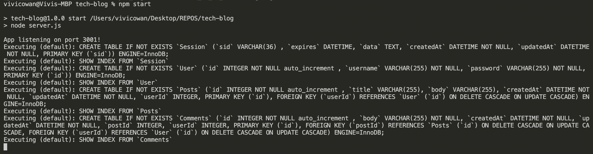
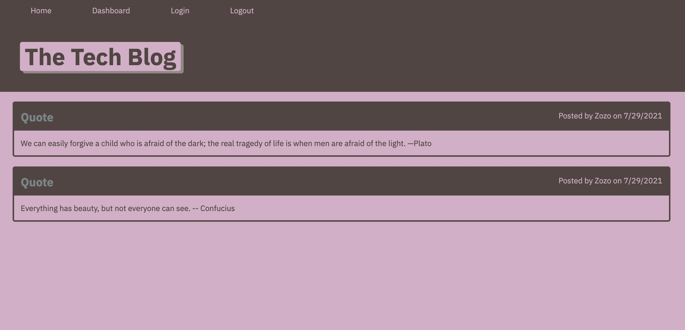

# Tech-Blog

## Heroku Deployment Link
  
  [Tech-Blog App](https://lit-wave-94013.herokuapp.com/)

## Description: 
- For this task, I wanted to allow developers to have a place to write about tech. The developer can post articles, blog posts, and share his opinion.  
- The reason I built this tech-blog was to incorporate the MVC paradigm into this app. 
- This task helped me gain a better understanding of the MVC paradigm and the use of sessions.

## Install:
    - Before running this app, run an ("npm i") to grab all dependencies.
 
## Mock-Up:

### Dashboard:

